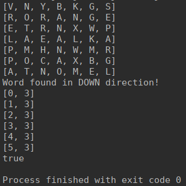

# WordPuzzleSearcher
Simple cli-program that finds a word in a word puzzle in all directions.

Could be used in combination with a dictionary to brute-force every word puzzle.

## Output example for BANANA

